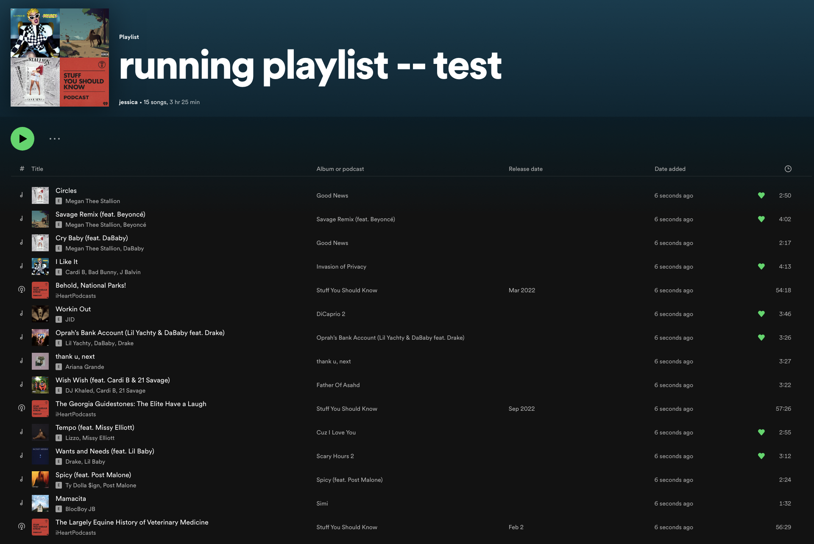

# running-playlist-generator

Simple Go app built with Gin to blend random choices from two Spotify playlists into one that matches a provided pattern. 

## Usage

`cp .env_example .env` & update `.env` w/ playlist IDs (available from the playlists' URLs), `go build; go run main.go`

### Example: 

Inputs:

- Playlist 1: "Running music"

- Playlist 2: "Podcast episodes"

- \# of pocast episodes: 3

- \# of songs between each episode: 4

Output: 

- playlist of `{song, song, song, song, episode} x 3`

Example output:

## Inspiration

I'm a slow runner and some of my longer training runs can pass the 2hr mark. I like listening to podcasts to pass the time, but prefer to keep a couple songs in the queue to introduce a "tempo" aspect to my pacing. Long story short, I hated to manually add songs to my Spotify queue so I could get "random" songs with podcasts sprinkled in and wanted to play around with Go, so I wrote this script.

## WIP

- tests!
- frontend
- clearer error messages
- determine how to handle user OAuth tokens:
  - persist the active & refresh token + write middleware to check if valid? 
  - make the Login/OAuthCallback handler's logic into middleware since users are only prompted to approve the scopes once anyways?